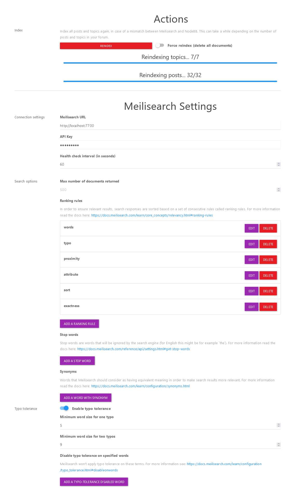

# Meilisearch Plugin for NodeBB

A search plugin integrating [Meilisearch](https://www.meilisearch.com/).

Make sure to disable `nodebb-plugin-dbsearch` when using this plugin.

## Installation

1. Make sure you have access to an instance of [Meilisearch](https://www.meilisearch.com/). This can be meilisearch cloud or a local instance (see [their docs](https://www.meilisearch.com/docs/learn/getting_started/installation) for installation instructions)

2. Install the plugin: `npm install nodebb-plugin-meilisearch` (or just use the ACP)

3. Set your URL and API Key in the ACP under `admin/plugins/meilisearch`

> **Warning**
> Currently this plugin doesn't do a good job of informing the user about configuration errors, make sure your Meilisearch instance is reachable by NodeBB and that the plugin is configured correctly

## Screenshots

#### ACP:

